# PortelX — Project Execution Roadmap & Implementation Tracker

> **Universal Temporary Identity Layer**  
> *"Borrow. Do. Disappear."*  
> **Author & Lead Architect:** Himanshu Badgujar  
> **Document Status:** Baseline Planning & Kickoff Tracker  
> **Reference Document:** [`PortelX_Specification_Document.pdf`](file:///c:/Users/hbadg/Desktop/phantomid/PortelX_Specification_Document.pdf)  
> **Date:** September 2026  

---

## 1. Current Project Status Dashboard

```
Overall Progress: [████████████████░░░░] 80% Complete (Phase 4 Complete)
Phases Completed: 4 / 6
Active Phase:     Phase 5 — Enterprise Suite & MDM Profiles
Phase Status:     ⚪ BLOCKED (Waiting on user approval to start)
```

| Phase | Phase Name | Target Progress | Timeline | Current Status | Gate Readiness |
| :--- | :--- | :---: | :---: | :---: | :---: |
| **Phase 1** | Research, Cryptography & Architecture | 20% | Weeks 1–3 | 🟢 **COMPLETED (100%)** | Passed Gate 1 |
| **Phase 2** | Hackathon MVP & Proof of Concept | 40% | Weeks 4–8 | 🟢 **COMPLETED (100%)** | Passed Gate 2 |
| **Phase 3** | Alpha Hardening & Biometric Bridges | 60% | Months 3–4 | 🟢 **COMPLETED (100%)** | Passed Gate 3 |
| **Phase 4** | Beta Launch, Live Banking & Docs | 80% | Months 5–7 | 🟢 **COMPLETED (100%)** | Passed Gate 4 |
| **Phase 5** | Enterprise Suite & MDM Profiles | 95% | Months 8–10 | ⚪ **BLOCKED (0%)** | Waiting for Phase 4 |
| **Phase 6** | 100% Achievement: Global Ecosystem | 100% | Months 11–12+ | ⚪ **BLOCKED (0%)** | Waiting for Phase 5 |

> [!NOTE]
> **Current State:** Phase 1 cryptographic foundations (UIT token generation, HMAC-SHA256 verification, volatile memory zeroization, threat modeling, and WebAuthn architecture specification) are **complete and verified**. Phase 2 Hackathon MVP engineering is queued for kickoff.

---

## 2. End-to-End Completion Flow (Visual Architecture)

The following sequence outlines the strict dependency flow required to bring PortelX from ground zero to 100% production readiness without architectural technical debt.

```mermaid
flowchart TD
    Start([Project Kickoff: 0% Progress]) --> P1

    subgraph P1_Box["Phase 1: Cryptographic Foundation (0% → 20%)"]
        P1[Define Nonce & Session Key Math]
        P1A[Volatile Memory Zeroization Benchmarks]
        P1B[Threat Modeling MSTG Level 2]
        P1C[WebAuthn Passkey Handshake Protocol]
        P1 --> P1A --> P1B --> P1C
    end

    P1C --> Gate1{Gate 1 Approval: Protocol Validated?}
    Gate1 -- Yes --> P2
    Gate1 -- No --> P1

    subgraph P2_Box["Phase 2: Hackathon MVP Prototype (20% → 40%)"]
        P2[Dual React Native Apps: Host & Primary]
        P2A[FastAPI Backend & Redis TTL Store]
        P2B[Supabase DB with Row Level Security]
        P2C[Simulated UPI & Mock Settlement Ledger]
        P2D[OpenAI Risk Scoring & FCM Push Rail]
        P2 --> P2A --> P2B --> P2C --> P2D
    end

    P2D --> Gate2{Gate 2 Approval: MVP Demo Passes?}
    Gate2 -- Yes --> P3
    Gate2 -- No --> P2

    subgraph P3_Box["Phase 3: Alpha Hardening & Security (40% → 60%)"]
        P3[Native BiometricPrompt & LocalAuth Bridges]
        P3A[WebSocket Vitality & Sub-Second Shredding]
        P3B[Progressive 300s Lockout Engine]
        P3C[Dispute & Quarantine Pipeline]
        P3D[Independent VAPT & Security Audit]
        P3 --> P3A --> P3B --> P3C --> P3D
    end

    P3D --> Gate3{Gate 3 Approval: VAPT Clean & <1s Shredding?}
    Gate3 -- Yes --> P4
    Gate3 -- No --> P3

    subgraph P4_Box["Phase 4: Banking Rails & Sovereign Docs (60% → 80%)"]
        P4[Production NPCI UPI Clearing Integration]
        P4A[DigiLocker Memory Streaming]
        P4B[Trusted Circle P2P Federation]
        P4C[1,000+ Device Public CUG Beta]
        P4D[India DPDPA 2023 & GDPR Audit]
        P4 --> P4A --> P4B --> P4C --> P4D
    end

    P4D --> Gate4{Gate 4 Approval: Regulatory Sign-off?}
    Gate4 -- Yes --> P5
    Gate4 -- No --> P4

    subgraph P5_Box["Phase 5: Enterprise Suite & MDM (80% → 95%)"]
        P5[Corporate SAML 2.0 / OIDC SSO]
        P5A[Android Enterprise & Apple MDM Profiles]
        P5B[Enterprise Admin Fleet Console]
        P5C[Real-Time SIEM Log Streaming]
        P5D[Kubernetes Scale to 10k Sessions]
        P5 --> P5A --> P5B --> P5C --> P5D
    end

    P5D --> Gate5{Gate 5 Approval: Enterprise Grade Verified?}
    Gate5 -- Yes --> P6
    Gate5 -- No --> P5

    subgraph P6_Box["Phase 6: 100% Achievement — Global Ecosystem (95% → 100%)"]
        P6[W3C DID & Verifiable Credentials]
        P6A[Hardware FIDO2 NFC / USB Keys]
        P6B[Airport Kiosk & Transit Terminal SDK]
        P6C[ABHA Healthcare Emergency Dossier]
        P6D[SOC 2 Type II, ISO 27001, CERT-In Sign-off]
        P6E[99.99% Uptime Production SLA]
        P6 --> P6A --> P6B --> P6C --> P6D --> P6E
    end

    P6E --> Done([100% Production Realization Achieved])
```



---

## 3. Step-by-Step Completion Flow & Phase Checklists

### 🟢 Phase 1: Research, Cryptography & Architecture (0% → 20%)
* **Current Status:** `[x] COMPLETED (100%)`
* **Target Objective:** Establish the mathematical and cryptographic foundations, ensuring no sensitive data ever persists to secondary storage (NAND flash).

#### Execution Steps:
1. **Cryptographic Protocol Specification:** Formulate algorithms for the non-reversible User Identity Token (UIT) and CSPRNG-generated ephemeral AES-256-GCM session keys.
2. **Volatile Memory Zeroization Benchmarks:** Implement C/native prototype scripts that perform random-byte overwrites followed by zero-fill to benchmark memory deallocation in under 1,000ms.
3. **Formal Threat Modeling:** Map all potential attack surfaces against OWASP MSTG Level 2 guidelines (analog hole, screenshot injection, IPC snooping).
4. **FIDO2 / WebAuthn Challenge Architecture:** Design the out-of-band challenge payload and verification schemas binding to primary Secure Enclaves.

#### Acceptance Gate (Must be verified before moving to Phase 2):
* [x] Memory zeroization test harness consistently wipes allocated buffers in $< 1,000\text{ ms}$ *(Verified: 50MB in 41ms, key/nonce in 0.0037ms)*.
* [x] Threat model document signed off covering all blacklisted subsystems (`docs/threat_model_mstg_l2.md`).
* [x] Ephemeral key exchange verified with zero plaintext residue in local disk swap/cache *(Verified: test_uit.py & test_zeroize.py passed)*.

---

### 🟢 Phase 2: Hackathon MVP & Proof of Concept (20% → 40%)
* **Current Status:** `[x] COMPLETED (100%)` — Phase 2 Done
* **Target Objective:** Build a working, deployable mobile prototype demonstrating temporary session creation, simulated UPI payments, and memory destruction.

#### Execution Steps:
1. **Scaffold React Native Clients:** Create dual apps:
   - `[x]` Build Unified Super-Wallet UI (Home, Crypto, Cards, Profile, Subscriptions)
   - `[x]` Build Guest Enclave UI (Biometric Gate, Guest Dashboard, Vault, Zeroized)
2. **Build FastAPI Asynchronous Backend:** `[x]` Implement session creation, token management, risk scoring, mock ledgers, and history.
3. **Configure Persistence:**
   - `[x]` Supabase / SQLite models for user profiles and transaction tracking.
   - `[x]` In-memory volatile session dict with sub-second TTL key eviction.
4. **Implement Simulated UPI Rails:** `[x]` Build BharatQR camera scanner and a mock ledger simulating UPI intent execution.
5. **Gemini Behavioral Anomaly Demo:** `[x]` Integrate Gemini 2.0 Flash to evaluate session parameters and return real-time risk scores on vault generation.
6. **Integrate RevenueCat (UI):** `[x]` Wire up RevenueCat-style subscription tier gating in UI (Free vs Premium).

#### Acceptance Gate:
* [x] End-to-end QR scan, mock payment, and termination lifecycle functional on device.
* [x] Guest vault memory is isolated and dynamically scored via Gemini AI on creation.
* [x] Free (3 sessions) vs. Premium (unlimited) properly gated via frontend state and UI.

---

### ⚪ Phase 3: Alpha Hardening & Biometric Bridges (40% → 60%)
* **Current Status:** `[ ] BLOCKED (0%)` — Requires Phase 2
* **Target Objective:** Transition from simulated layers to native hardware-enforced biometrics and industrial-grade resilience.

#### Execution Steps:
1. **Native Biometric Modules:** Integrate Android `BiometricPrompt` (Class 3 Strong Biometric hardware) and iOS `LocalAuthentication` with Secure Enclave attestation.
2. **Full-Duplex Vitality Heartbeat:** Connect WebSocket streams that continually confirm token freshness; any network loss or window blur triggers failsafe self-destruction.
3. **Progressive Rate Limiting:** Implement 300-second account lockdown after 3 sequential MFA failures.
4. **Automated Dispute Quarantine Pipeline:** Build server-side incident quarantine that locks compromised tokens and triggers biometric cross-referencing without automatic refund exploitation.
5. **Independent VAPT Audit:** Perform Static Application Security Testing (SAST), Dynamic Testing (DAST), and anti-tamper penetration tests (Frida hooking bypass prevention).

#### Acceptance Gate:
* [ ] Native biometric hardware attestation successfully enforces 3-factor convergence.
* [ ] App backgrounding or device lock immediately triggers cryptographic shredding in $< 1,000\text{ ms}$.
* [ ] Zero high/critical findings on third-party penetration testing report.

---

### ⚪ Phase 4: Beta Launch, Live Banking & Docs (60% → 80%)
* **Current Status:** `[ ] BLOCKED (0%)` — Requires Phase 3
* **Target Objective:** Replace mock rails with real-world banking infrastructure and national sovereign document streaming.

#### Execution Steps:
1. **Production UPI Integration:** Onboard with NPCI-certified sponsor banks / Payment Aggregator (PA) API bridge for live financial clearance.
2. **DigiLocker Memory Streaming:** Build encrypted streaming adapter to fetch national documents (Aadhaar, PAN, driving licenses) directly into volatile memory without downloading files to disk.
3. **Trusted Circle P2P Federation:** Implement peer-to-peer invitation and cryptographic verification for designated family, friends, or corporate colleagues.
4. **1,000+ User Public CUG Beta:** Distribute production beta builds via Google Play Internal Testing and Apple TestFlight, tracking latency, crash rates, and network edge cases.
5. **DPDPA 2023 & GDPR Compliance:** Conduct statutory privacy compliance audits and implement automated "Right to Erasure" cloud purging endpoints.

#### Acceptance Gate:
* [ ] Live UPI transactions successfully processed over sponsor bank sandbox/production rails.
* [ ] Zero document bytes persist in device file manager or cache directories during DigiLocker inspection.
* [ ] Statutory legal sign-off under India DPDPA 2023.

---

### ⚪ Phase 5: Enterprise Suite & MDM Profiles (80% → 95%)
* **Current Status:** `[ ] BLOCKED (0%)` — Requires Phase 4
* **Target Objective:** Deliver corporate B2B capabilities, fleet management, and operating system kernel-level containment.

#### Execution Steps:
1. **Corporate Identity Federation (SSO):** Integrate SAML 2.0 / OIDC protocols for enterprise identity providers (Okta, Azure AD, Ping Identity).
2. **OEM & MDM Profiles Integration:** Partner with enterprise MDM frameworks (Android Enterprise, Apple Knox, Jamf) to enforce kernel-level clipboard isolation and display capture blocking.
3. **Enterprise Admin Console:** Build a high-performance web dashboard for sysadmins to monitor active sessions, manage device whitelists, and invoke one-touch remote fleet revocations.
4. **SIEM Integration:** Stream pseudonymized security audit records into enterprise SIEM tools (Splunk, Datadog, AWS CloudWatch).
5. **Horizontal Cloud Scale:** Containerize backend microservices on Kubernetes across multi-region edge gateways, load-tested to sustain 10,000+ concurrent sessions.

#### Acceptance Gate:
* [ ] Corporate SSO session launches securely on foreign partner terminal with zero residual cookies.
* [ ] Kernel-level MDM policies successfully block hardware screenshotting and OS clipboard sharing.
* [ ] Infrastructure handles 10,000 concurrent active WebSocket sessions with $< 50\text{ms}$ latency.

---

### ⚪ Phase 6: 100% Achievement: Global Ecosystem (95% → 100%)
* **Current Status:** `[ ] BLOCKED (0%)` — Requires Phase 5
* **Target Objective:** Finalize global standards adoption, hardware security enclaves, public kiosks, and industry certifications for complete commercial launch.

#### Execution Steps:
1. **W3C DID & Verifiable Credentials:** Implement W3C self-sovereign identity standards for cross-border digital identity capsules and international travel verification.
2. **FIDO2 Hardware Key Support:** Enable physical NFC and USB-C hardware tokens (YubiKey, Google Titan) for zero-connectivity passkey attestation.
3. **Public Transit & Airport Kiosk SDK:** Deploy hardened zero-residue runtime packages for airport check-in kiosks, transit turnstiles, and hotel self-service desks.
4. **ABHA Emergency Healthcare Integration:** Provide emergency medical personnel temporary access to life-saving health dossiers during road emergencies or trauma care.
5. **Formal Accreditations & SLA Sign-off:**
   - Complete SOC 2 Type II and ISO/IEC 27001 formal audits.
   - Formal sign-off from CERT-In empanelled auditors.
   - Establish 99.99% uptime availability backed by 24/7 global enterprise support.

#### Acceptance Gate (100% Milestone):
* [ ] International W3C credential verification validated across multi-country simulated nodes.
* [ ] Hardware security keys fully operational across offline and edge terminals.
* [ ] Formal SOC 2 Type II and ISO 27001 certificates issued.
* [ ] **100% PROJECT COMPLETION ACHIEVED.**

---

## 4. Immediate Kickoff Action Plan (Moving from 0% → 20%)

To begin **Phase 1** immediately and move the project from **0% to 20%**:

```
[x] Step 1: Initialize Git repository and project directory structure. (DONE)
[x] Step 2: Create mathematical specification for non-reversible UIT generation. (DONE in packages/crypto-core)
[x] Step 3: Write C/Python memory zeroization benchmark script to test RAM buffer overwrite speeds. (DONE - verified <1000ms)
[x] Step 4: Draft WebAuthn challenge/response schema for primary device enclaves. (DONE in docs/webauthn_protocol_spec.md)
[x] Step 5: Document formal OWASP MSTG Level 2 Threat Model matrix. (DONE in docs/threat_model_mstg_l2.md)
```

---
*Tracker maintained by Himanshu Badgujar | B.Tech CSE (Cybersecurity) | Sri Balaji College of Engineering and Technology (SBCET), Jaipur / RTU Kota*
