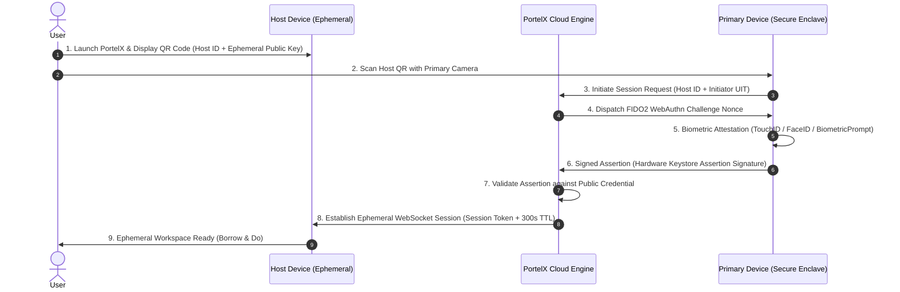

# PortelX — FIDO2 / WebAuthn Passkey Handshake Protocol

**Document Version:** 1.0  
**Domain:** Out-of-Band Primary Enclave Authentication & Dynamic Session Binding  

---

## 1. Handshake Protocol Sequence



---

## 2. Cryptographic Enclave Properties

1. **Hardware Root of Trust:** Primary passkey private keys are generated inside the device's hardware security module (Android StrongBox / iOS Secure Enclave) and marked as non-exportable.
2. **Ephemeral Binding:** The assertion signature incorporates the Host Device ID and a dynamic single-use challenge nonce, preventing token transplantation.
3. **Panic Revocation Stream:** Primary retains an open WebSocket to immediately send a remote wipe payload:
```json
{
  "action": "PANIC_PURGE",
  "sessionId": "sess_98fa71e...",
  "timestamp": 1789218200,
  "signature": "3045022100...[EnclaveSignature]"
}
```
Upon receipt, Host triggers immediate multi-pass zeroization in $< 1,000\text{ ms}$.

